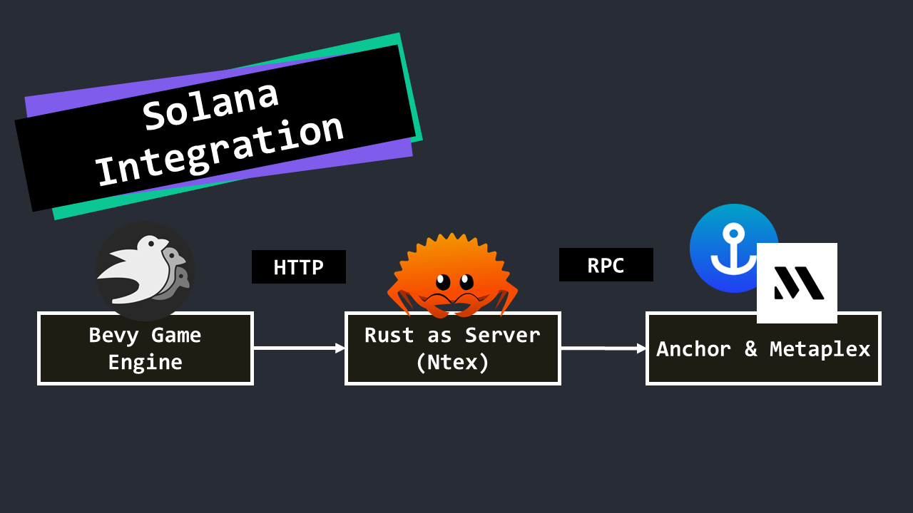

# 🧗‍♂️ SolClimber – A 3D NFT Mountain-Climbing Game on Solana

## 🎮 Gameplay Concept

Players climb procedurally dangerous mountain terrain. If they **successfully reach the summit**, their climb is recorded on-chain and they are rewarded with an **NFT**.

If they **fall and die**, their death is also **logged on-chain** as part of their character’s history.

The NFTs earned by summiting:

- Follow the **Metaplex metadata standard**
- Can be **traded peer-to-peer**
- Will later be **listed on the in-game marketplace** (coming soon)

Climb high. Die proud. Loot hard.

## ✅ Features Completed

- 3D movement system: walking, running, jumping
- Camera system: third-person views
- Death detection & on-chain death counter
- Summit detection & on-chain climb record
- NFT reward system upon summit (1 NFT per successful climb)
- Integration with Solana via custom smart contracts
- NFT metadata stored using the Metaplex standard

## ⚒️ Tech Stack

| Component          | Tech Used                                                      |
| ------------------ | -------------------------------------------------------------- |
| 🎮 Game Engine     | [`Bevy`](https://bevyengine.org/) (Rust)                       |
| 🌐 HTTP Server     | [`Ntex`](https://github.com/ntex-rs/ntex) (Rust)               |
| 📦 Smart Contracts | [`Anchor`](https://www.anchor-lang.com/docs) (Rust for Solana) |
| 🖼 NFT Standard     | [`Metaplex Token Metadata`](https://www.metaplex.com/)         |
| 🧊 3D Assets       | [`Blender`](https://www.blender.org/)                          |

## 🚧 In Progress

- In-game NFT **Marketplace** for listing/selling earned NFTs
- **P2P NFT trading** system between players
- Stamina, oxygen, and weather mechanics
- Procedural terrain with unique mountain biomes
- UI/UX improvements and animations

## 🧠 Vision

This game blends real-time 3D gameplay with blockchain-backed progression, aiming to:

- Provide **true digital ownership** of in-game achievements
- Let players **earn & trade NFTs** based on skill
- Encourage **risk vs reward** decisions that matter

## 🔗 License

Apache-2.0

## 🚫 NO COIN. NO TOKEN. JUST NFTs. 🚫

This project uses NFTs for gameplay and collectibles only (Unavailable in mainnet for now just in devnet only).
There is NO native cryptocurrency or token.
If you see any coin or token claiming to be related to SOL Climber, it is a scam.
