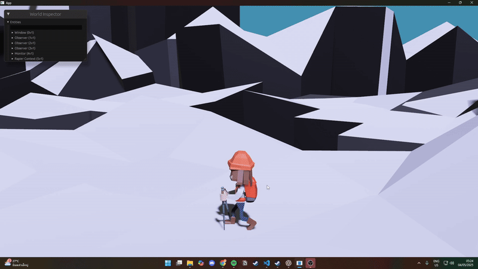

# 🧗 SOL Climber: On-Chain Death, Glory, and Loot

**SOL Climber** is a brutal, 3D survival mountain climbing game powered by **Rust + Bevy + Solana Anchor**.  
Face nature, climb deadly peaks, and leave your mark — or your corpse — on-chain.

> 🪦 Every death writes to the chain.  
> 🎒 Every gear drop becomes loot.  
> 🧢 Every NFT you wear has a story.

# 🎥 Videos

Technical: https://www.youtube.com/watch?v=i1vORoPmcuc
Gameplay: https://www.youtube.com/watch?v=J8Umv1QCEyE

## 🌄 Game Concept

An immersive **co-op climbing simulator** where every step is a risk, every item is an NFT, and **every fall is permanent**.

### 🧗 Climb or Die

- Choose from a variety of **procedurally generated mountains**, each with unique weather, terrain, and hazards.
- Plan your climb, manage your **HP** and **Stamina**, and pray you reach the summit before your legs — or rope — give out.

### 🔥 Hardcore Survival

- **Permadeath**: If you die, your body and inventory drop. Other players can loot your remains and mint your gear as NFTs.
- **Consumables**: Food, water, and first aid kits are limited. Trade or barter with other climbers... or leave them to die.

### 🎒 Loot = NFT

- Items like jackets, pants, boots, gloves, and tools are all **on-chain NFTs**.
- Every successful summit mints new loot based on mountain difficulty.
- **Dropped items stay on-chain** — visible, lootable, and tradeable.

## 💱 Real On-Chain Economy

- **All items = NFTs** stored on **Solana**, fully ownable and tradable.
- Built-in **player marketplace** with SOL-based listing and barter mechanics.
- **Official in-game store** provides basic supplies (food, meds) using SOL, fueling the game’s economy.
- Small **transaction fee** on marketplace sales generates game revenue.

## 🤝 Multiplayer Co-Op (Optional)

- Climb solo or with a team.
- Players can trade items mid-run or help revive others using shared gear.
- Betrayal? Optional.

## 🧾 On-Chain Progress Tracking

Your journey is immortalized on-chain:

- ✅ Number of successful summits
- 🪦 Total deaths
- 🏕️ Checkpoints reached
- 🎒 NFT gear owned and lost
- 🧠 Rare climbs + unique expedition IDs

All data is **stored on Solana**. No resets. No bullshit. Just legacy.

## 🛠️ Tech Stack

- 🦀 Rust (game & on-chain logic)
- 🎮 Bevy (3D rendering + game engine)
- 🧠 Solana Anchor (program logic + player statistics)
- 🧾 Metaplex (NFT metadata + marketplaces)

## 🧪 For Colosseum Breakout Hackathon

**SOL Climber** is built as a fully decentralized gaming experience.  
We don’t just use blockchain — **we design gameplay around it**.  
This is more than GameFi. This is **GameDeathFi**.

## 🚫 NO COIN. NO TOKEN. JUST NFTs. 🚫

This project uses NFTs for gameplay and collectibles only (Unavailable in mainnet for now just in devnet only).
There is NO native cryptocurrency or token.
If you see any coin or token claiming to be related to SOL Climber, it is a scam.

> Climb high. Die proud. Loot hard.
